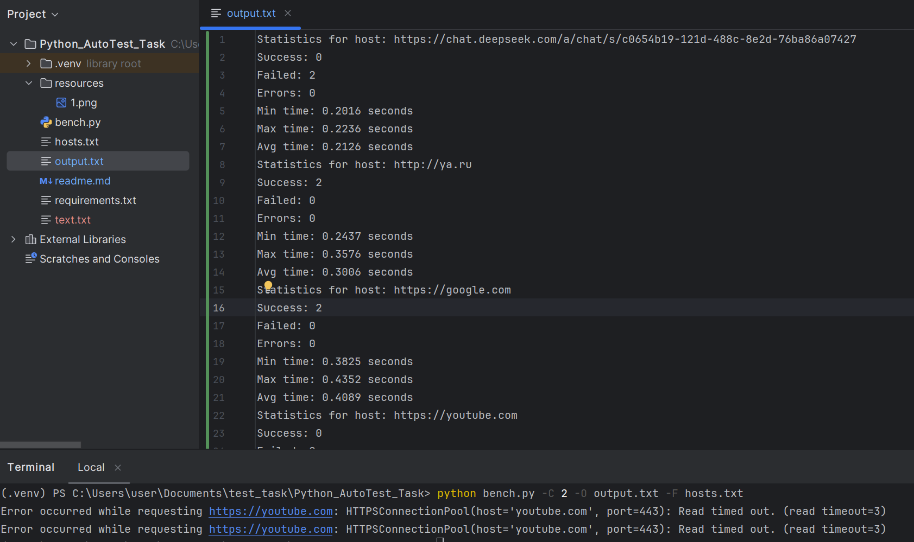

# Описание работы программы с примерами вывода и инструкции по запуску

## python bench.py опции
Команда запускает тестирование доступности сервера по http
```commandline
python bench.py -H (str) -C (int) -F (Path) -O (Path)
```
## Опции и их описание:
```commandline
–H/--hosts  # тип str Список хостов, разделенных запятыми, для тестирования
–C/--count  # тип int Количество запросов для отправки каждому хосту
-F/--file   # тип Path Файл, из которого будут считаны хосты для тестирования
-O/--output # тип Path Запись выходной информации в файл
# Примечание нельзя использовать параметры –H/--hosts и -F/--file одновременно
# а также обязателен хотя бы один параметр из –H/--hosts и -F/--file
```
---

# Формат ссылок http 
### Ссылки ограничиваются регулярным выражением 
```python
r'^https?://[^\s/$.?#].[^\s]*$'
```
### Объяснение регулярного выражения для ссылки

```
Регулярное выражение r'^https?://[^\s/$.?#].[^\s]*$' проверяет, что строка:
    1. Начинается с http:// или https://.
    2. После :// идет хотя бы один символ, который не является пробелом, /, $, ., ? или #.
    3. После этого может идти любое количество символов, которые не являются пробелами.
    4. Строка должна заканчиваться после этих символов (без пробелов в конце).
```
# Входной файл со ссылками


Пример файла hosts.txt может выглядить так (ссылки должны соответствовать регулярному выражению, упомянутого ранее):


**Примечание:** ссылки разделяются \n то есть переходом на слеющую строку
```commandline
http://ya.ru
https://google.com
https://youtube.com
https://chat.deepseek.com/a/chat/s/c0654b19-121d-488c-8e2d-76ba86a07427
```
---

# Выходной файл:

При указании выходного файла (output.txt), данные в файл дописываются и выглядят следующим образом:
```
Statistics for host: https://youtube.com
Success: 0
Failed: 0
Errors: 2
Min time: 0.0000 seconds
Max time: 0.0000 seconds
Avg time: 0.0000 secondsStatistics for host: http://ya.ru
Success: 2
Failed: 0
Errors: 0
Min time: 0.1726 seconds
Max time: 0.4500 seconds
Avg time: 0.3113 seconds
Statistics for host: https://google.com
Success: 2
Failed: 0
Errors: 0
Min time: 0.3601 seconds
Max time: 0.3664 seconds
Avg time: 0.3633 seconds
Statistics for host: https://youtube.com
Success: 0
Failed: 0
Errors: 2
Min time: 0.0000 seconds
Max time: 0.0000 seconds
Avg time: 0.0000 seconds
```
# Примеры

Команда запускает тестирование доступности сервера по http:


```commandline
python bench.py -H "http://ya.ru,https://google.com,https://youtube.com" -C 2

# -H http://ya.ru, https://google.com, https://youtube.com
# -C 5 количество запросов
```
Вывод:

Команда запускает тестирование доступности сервера по http:

```commandline
python bench.py -H "http://ya.ru,https://google.com,https://youtube.com" -C 2 -O output.txt

# -H http://ya.ru,https://google.com,https://youtube.com
# -C 2 количество запросов
# -O text.txt
```
Вывод:

Команда запускает тестирование доступности сервера по http:

```commandline
python bench.py -C 2 -O output.txt -F hosts.txt

# -C 2 количество запросов
# -O text.txt
# -F hosts.txt
```

Команда вызовет ошибку:
usage: bench.py [-h] [-H HOSTS] [-C COUNT] [-F FILE] [-O OUTPUT]
bench.py: error: Specify only one of -H/--hosts or -F/--file.

```commandline
python bench.py -H "http://ya.ru,https://google.com,https://youtube.com" -C 2 -O output.txt -F hosts.txt
```
Вывод:\
(вывод аналогичен предыдущему)
